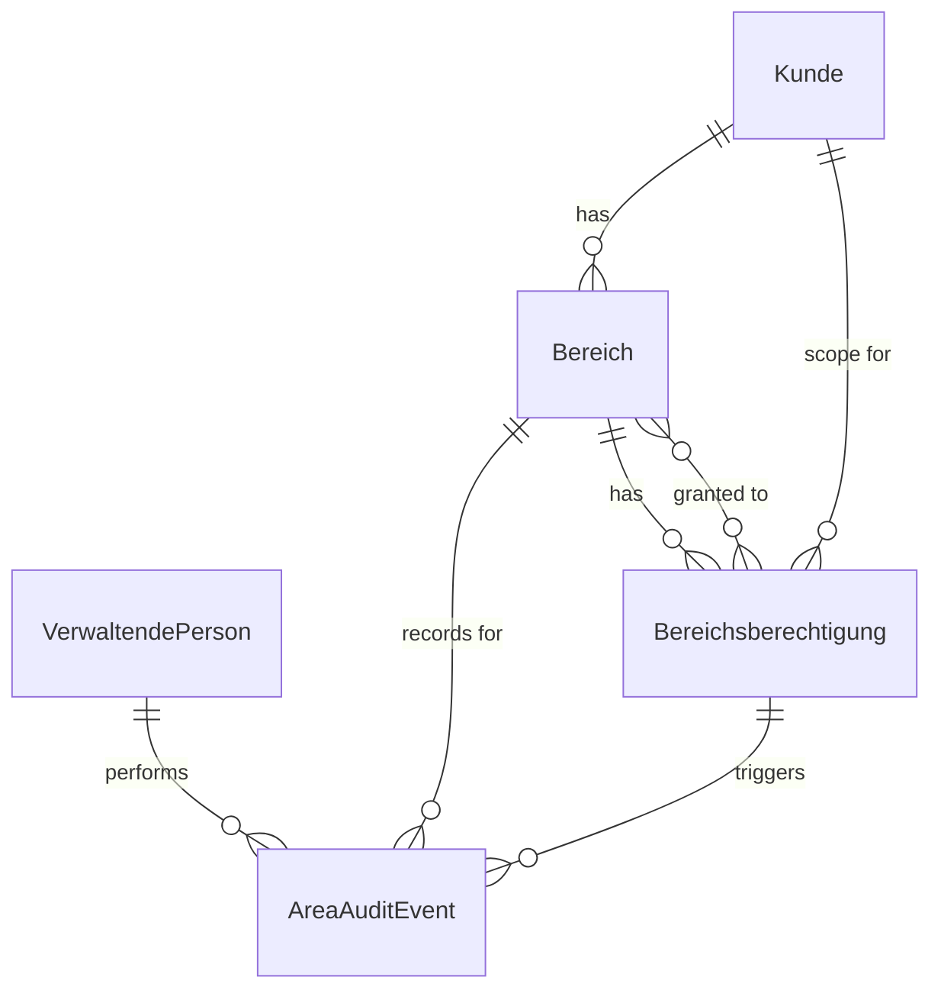

# Data Model: Bereich/Kunde anlegen und kundenbezogene Zugriffsrechte

## Entity: Kunde (Customer)

**Purpose**: Represents an organization or party whose context is captured when an area is created or reused.

**Fields**:

- `customerId`: unique identifier for the customer
- `name`: organization or party name (required)
- `identifier`: business identifier (e.g., tax ID, registration number)
- `status`: active, inactive, or suspended
- `createdAt`: timestamp of initial creation
- `updatedAt`: timestamp of last update

**Validation Rules**:

- Customer name is mandatory.
- Customer identifier must be unique across all customers.
- A customer can have multiple areas associated with it.

---

## Entity: Bereich (Area)

**Purpose**: Represents a manageable unit within a customer context that has its own access rights.

**Fields**:

- `areaId`: unique identifier for the area
- `customerId`: reference to the associated customer
- `name`: area name (required)
- `description`: optional area description
- `status`: active, inactive, or archived
- `createdAt`: timestamp of initial creation
- `updatedAt`: timestamp of last update

**Validation Rules**:

- Area name must be unique within the customer context.
- An area must always be associated with exactly one customer.
- An area cannot be deleted if it has active permissions assigned.

---

## Entity: Bereichsberechtigung (Area Permission)

**Purpose**: Represents the grant, revocation, or assignment of access rights for a specific area.

**Fields**:

- `permissionId`: unique identifier for the permission record
- `areaId`: reference to the associated area
- `userId`: reference to the user who is granted or denied access
- `roleName`: the role used for the access decision (e.g., `Kund:in`, `Berater:in`)
- `grantedAt`: timestamp of the permission grant
- `grantedBy`: admin identity that performed the permission change
- `changeReason`: optional administrative note for support or audit
- `expiresAt`: optional expiration timestamp for time-limited permissions

**Validation Rules**:

- A permission must reference a valid area and user.
- The `grantedBy` field is mandatory for all create, update, and revoke operations.
- A user can have multiple area permissions across different areas.
- A permission for a specific area and user must be unique (no duplicates).

---

## Entity: Verwaltende Person (Administrator)

**Purpose**: Represents an authorized person who can create areas and manage area permissions. This entity is derived from the existing User entity extended with admin capabilities.

**Fields**:

- `userId`: stable identity reference from the existing authentication system
- `displayReference`: pseudonymized reference usable in logs and admin views
- `activeRole`: current assigned role (must include admin capability for area management)
- `status`: active, inactive, or suspended according to the host application model

**Validation Rules**:

- Only users with an admin-capable role can create areas or manage permissions.
- Users without admin capabilities are restricted to area-specific permissions only.

---

## Entity: Area Audit Event

**Purpose**: Represents a structured business log entry for area creation, permission changes, and access-denied events.

**Fields**:

- `eventId`: unique identifier for the audit event
- `eventType`: `area_created`, `permission_granted`, `permission_revoked`, or `access_denied`
- `actorRef`: pseudonymized actor reference
- `subjectRef`: pseudonymized subject reference (area or customer) where applicable
- `target`: affected area, permission, or customer
- `outcome`: success or denied
- `occurredAt`: event timestamp
- `details`: optional structured data with additional context (e.g., reason code for denied access)

**Validation Rules**:

- Audit events must exclude raw secrets and unnecessary PII.
- Access denied events must include a structured reason code.

---

## Entity: Authorization Decision (Extended)

**Purpose**: Captures the outcome of evaluating access to an area or action, extending the existing Authorization Decision entity from the role-based access control.

**Fields**:

- `userId`: evaluated user reference
- `roleName`: role used for the decision, or null when unassigned
- `areaId`: the specific area being accessed, or null for global actions
- `target`: protected area or action key
- `result`: allowed or denied
- `reasonCode`: structured reason such as `missing_role`, `wrong_role`, `wrong_scope`, `inactive_user`, `no_area_permission`, or `customer_mismatch`
- `evaluatedAt`: timestamp of the decision

**Validation Rules**:

- Denied decisions must resolve to a non-empty reason code.
- Decision records used for logging must exclude raw secrets and unnecessary PII.
- Area-specific decisions must verify customer scope alignment.

---

## Entity Relationships

**Relationship Summary**:

- A Kunde has zero or more Bereiche.
- A Bereich belongs to exactly one Kunde and has zero or more Bereichsberechtigungen.
- A Bereichsberechtigung is granted to a user for a specific area and scope.
- VerwaltendePerson performs area creation and permission management, generating audit events.
- AreaAuditEvent records all area-related state transitions and access decisions.
