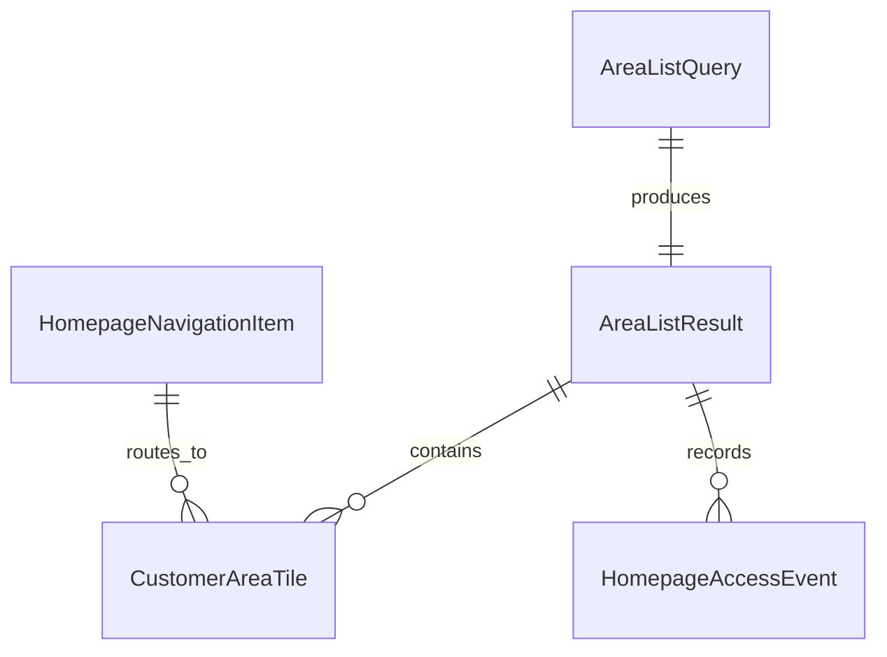

# Data Model: Startseite Kundenbereiche

## Entity: CustomerAreaTile

**Purpose**: Represents one customer area visible on the homepage grid/list for the current user.

**Fields**:

- `areaId`: unique area identifier
- `customerId`: associated customer context identifier
- `areaName`: display name shown in tile
- `areaStatus`: active, inactive, archived
- `navigationTarget`: route or target key for opening the area
- `lastUpdatedAt`: timestamp for freshness/sorting where applicable

**Validation Rules**:

- `areaId` must be unique in the response set.
- `areaName` is required and non-empty.
- Tile must only exist if access check passed server-side.

---

## Entity: HomepageNavigationItem

**Purpose**: Defines required navigation entries visible in homepage header.

**Fields**:

- `key`: canonical key (`home`, `customer-areas`)
- `label`: user-facing label
- `target`: route target
- `isVisible`: boolean computed by auth state

**Validation Rules**:

- For this feature, keys `home` and `customer-areas` are mandatory.
- Hidden navigation entries must not be emitted as enabled links.

---

## Entity: AreaListQuery

**Purpose**: Captures user input for searching and paginating customer area tiles.

**Fields**:

- `searchTerm`: optional text query
- `page`: 1-based page index
- `pageSize`: positive integer page size
- `sortBy`: optional deterministic sort key (default `areaName`)

**Validation Rules**:

- `page` must be >= 1.
- `pageSize` must be within configured safe bounds.
- `searchTerm` is normalized and length-limited before query execution.

---

## Entity: AreaListResult

**Purpose**: Represents paginated response payload for homepage area tiles.

**Fields**:

- `items`: array of `CustomerAreaTile`
- `page`: current page index
- `pageSize`: page size used
- `totalItems`: total count after auth + search filter
- `totalPages`: derived page count
- `isEmpty`: true when no accessible areas exist for query

**Validation Rules**:

- `items.length` must be <= `pageSize`.
- `totalPages` must match `totalItems` and `pageSize`.
- `isEmpty` must be true when `totalItems == 0`.

---

## Entity: HomepageAccessEvent

**Purpose**: Structured log event for homepage area retrieval and navigation authorization outcomes.

**Fields**:

- `eventType`: `areas_loaded`, `areas_empty`, `areas_denied`, `areas_error`
- `requestId`: correlation identifier
- `actorRef`: pseudonymized user reference
- `resultCount`: number of returned tiles where applicable
- `reasonCode`: optional denial/error reason key
- `occurredAt`: event timestamp

**Validation Rules**:

- `eventType` must be one of the allowed constants.
- Denied/error events must include a non-empty `reasonCode`.
- Event payload must not include raw tokens, emails, or secrets.

---

## Entity Relationships

**Relationship Summary**:

- A query produces exactly one paginated result envelope.
- A result contains zero or more authorized customer area tiles.
- Navigation items route users to homepage or customer-areas destinations.
- Access events are emitted for each list retrieval outcome.
