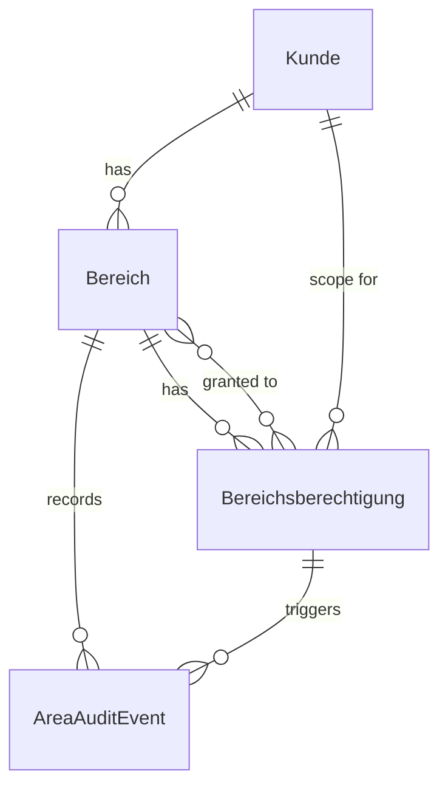

# Data Model: DCM-67 Bereichs- und Kundenzugriffsverwaltung

## Entity: Kunde

**Purpose**: Repräsentiert den Kundenkontext, dem ein Bereich zugeordnet ist.

**Fields**:
- `customerId`: eindeutiger Identifikator
- `name`: Kundenname (required)
- `identifier`: eindeutiges Geschäftskürzel, z. B. Steuernummer oder Kundenkennung
- `status`: `active` / `inactive` / `suspended`
- `createdAt`: Erstellungszeitpunkt
- `updatedAt`: Änderungszeitpunkt

**Validation**:
- `name` ist Pflicht.
- `identifier` muss in der Kundentabelle einzigartig sein.
- Kunden können mehrere Bereiche besitzen.

---

## Entity: Bereich

**Purpose**: Definiert eine verwaltbare Einheit mit zugehörigem Kundenkontext.

**Fields**:
- `areaId`: eindeutiger Identifikator
- `customerId`: Referenz auf `Kunde`
- `name`: Bereichsname (required)
- `description`: optional
- `status`: `active` / `inactive` / `archived`
- `createdAt`: Erstellungszeitpunkt
- `updatedAt`: Änderungszeitpunkt

**Validation**:
- `name` ist Pflicht.
- Kombination aus `customerId` und `name` muss eindeutig sein.
- Ein Bereich muss genau einem Kunden zugeordnet sein.

---

## Entity: Bereichsberechtigung

**Purpose**: Repräsentiert die explizite Zugriffsgewährung auf einen Bereich für einen Nutzer.

**Fields**:
- `permissionId`: eindeutiger Identifikator
- `areaId`: Referenz auf `Bereich`
- `userId`: Referenz auf den Nutzer
- `roleName`: Rollename oder Berechtigungskennzeichnung
- `grantedAt`: Zeitpunkt der Vergabe
- `grantedBy`: Admin-Identität, die die Vergabe durchgeführt hat
- `changeReason`: optionaler Hinweistext
- `expiresAt`: optionales Ablaufdatum

**Validation**:
- `areaId` und `userId` müssen gültig sein.
- `grantedBy` ist Pflicht.
- Ein Nutzer kann pro Bereich nur eine aktive Berechtigung haben.

---

## Entity: Bereichs-Audit-Event

**Purpose**: Strukturiertes Audit für Bereichsereignisse und Zugriffskontrollen.

**Fields**:
- `eventId`: eindeutiger Identifikator
- `eventType`: `area_created`, `permission_granted`, `permission_revoked`, `access_denied`
- `actorRef`: pseudonymisierte Aktorenkennung
- `subjectRef`: betroffener Bereich oder Kunde
- `target`: betroffenes Objekt
- `outcome`: `success` / `denied`
- `occurredAt`: Zeitstempel
- `details`: optionales strukturiertes Kontextobjekt

**Validation**:
- Keine rohen PII-Daten in `details`.
- Zugriffsverweigerungen benötigen einen strukturierten `reasonCode`.

---

## Entity: Authorization Decision

**Purpose**: Dokumentiert die Entscheidung für einen Zugriff auf einen Bereich.

**Fields**:
- `userId`: geprüfter Nutzer
- `roleName`: verwendete Rolle
- `areaId`: zu prüfender Bereich
- `target`: geschütztes Ziel
- `result`: `allowed` / `denied`
- `reasonCode`: z. B. `missing_role`, `no_area_permission`, `customer_mismatch`
- `evaluatedAt`: Zeitstempel

**Validation**:
- `result == denied` erfordert ein nicht-leeres `reasonCode`.

---

## Entity Relationships

## Query/DTO Models

### Bereich create request
- `customerId` oder Kunde-Daten
- `areaName`
- `description`

### Bereich permission request
- `areaId`
- `userId`
- `roleName`
- `grantedBy`
- `expiresAt` optional

### Kundenbereichs-Liste
- `searchTerm`
- `page`
- `pageSize`
- `sortBy`

### Kundenbereichs-Liste Response
- `items`: Liste autorisierter Bereiche
- `totalItems`
- `totalPages`
- `page`
- `pageSize`
- `isEmpty`
